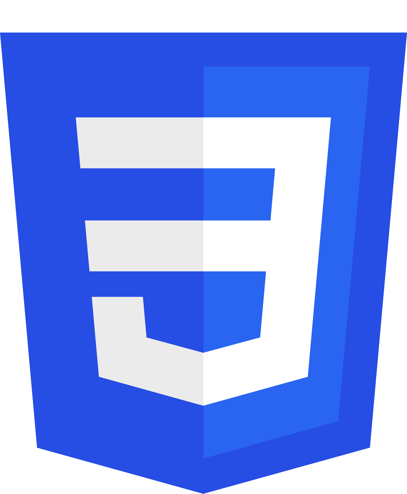
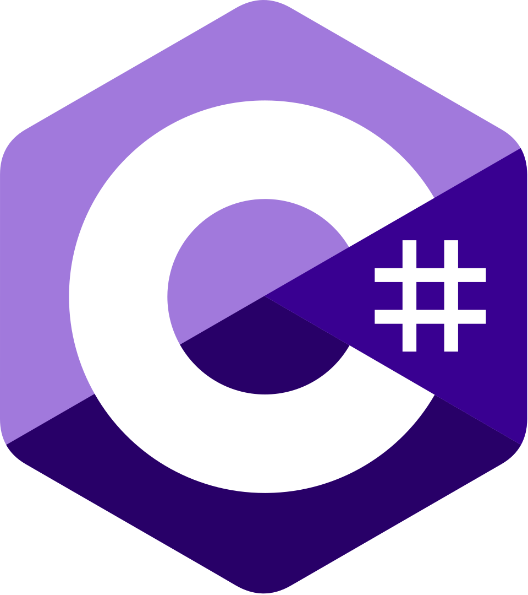
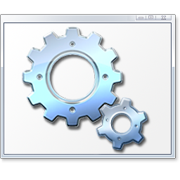
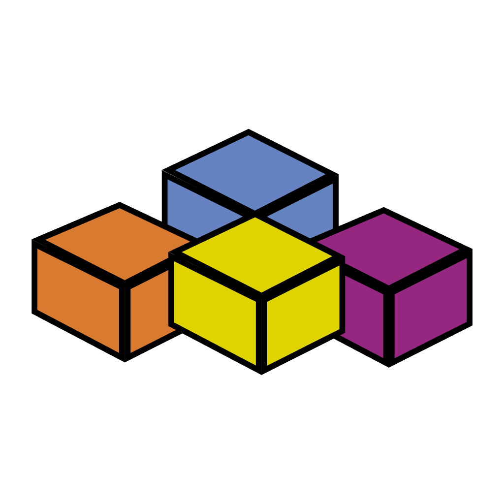
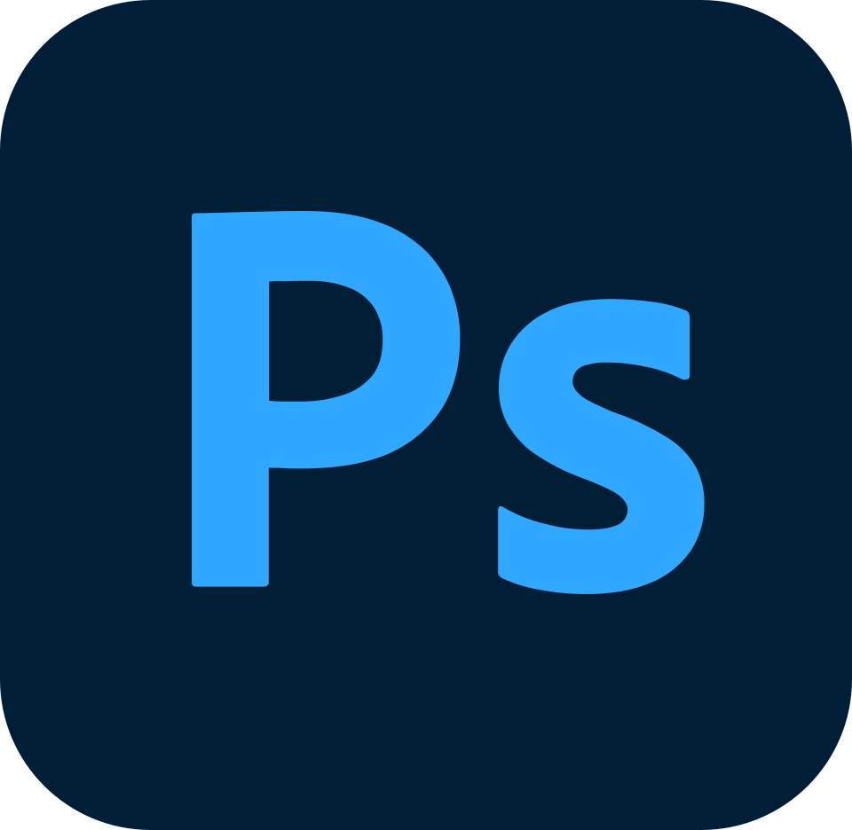

    

  
  
  
  

💻 IT enthusiast focused on <b>web development, automation & AI</b> 
⚡ I build practical tools, scripts and modern web projects 
📍 Based in Czech Republic

---

<h2 align="center">👨‍💻 About Me</h2>

Hi, I'm <b>neikiri</b> - a tech enthusiast from the Czech Republic focused on <b>web development, automation, and AI</b>.  

I enjoy building things that actually work in practice - from custom web solutions and backend systems to bots and smart tools powered by computer vision and automation.  

🧠 Constantly learning and experimenting with new technologies 
⚙️ Strong background in Linux, servers, and full-stack development 
🤖 Interested in AI, automation, and optimization 
🎨 Also experienced in design and UI/UX  

I like clean code, efficient solutions, and pushing things a bit further than necessary 😄

---

<h2 align="center">⚙️ Technology Stack</h2>

<table align="center">
  <tr>
    <td align="center" width="90">
       <b>HTML</b>
    </td>
    <td align="center" width="90">
       <b>CSS</b>
    </td>
    <td align="center" width="90">
       <b>PHP</b>
    </td>
    <td align="center" width="90">
       <b>JavaScript</b>
    </td>
    <td align="center" width="90">
       <b>C#</b>
    </td>
    <td align="center" width="90">
       <b>Python</b>
    </td>
    <td align="center" width="90">
       <b>MySQL</b>
    </td>
    <td align="center" width="90">
       <b>Bash</b>
    </td>
    <td align="center" width="90">
       <b>Batch</b>
    </td>
  </tr>

  <tr>
    <td align="center" width="90">
       <b>JSON</b>
    </td>
    <td align="center" width="90">
       <b>YAML</b>
    </td>
    <td align="center" width="90">
       <b>Markdown</b>
    </td>
    <td align="center" width="90">
       <b>Arduino</b>
    </td>
    <td align="center" width="90">
       <b>Pawn</b>
    </td>
    <td align="center" width="90">
       <b>GitHub</b>
    </td>
    <td align="center" width="90">
       <b>VBA</b>
    </td>
    <td align="center" width="90">
       <b>Excel</b>
    </td>
    <td align="center" width="90">
       <b>Photoshop</b>
    </td>
  </tr>
</table>

---

<h2 align="center">🚀 What I'm Working On</h2>

🔹 Automation tools & bots (Python + OpenCV) 
🔹 Web projects & custom admin systems 
🔹 AI integrations & experiments 
🔹 Server management & optimization (Linux / Apache / MySQL / Mail servers) 

---

<h2 align="center">📊 GitHub Stats</h2>

  

---

<h2 align="center">💡 Fun Facts</h2>

🐕 I have a dachshund named Čenda 
⚡ I enjoy optimizing everything (sometimes too much) 
🎯 I prefer practical solutions over theory 

---

  Built with ❤️ by neikiri

