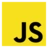
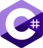
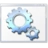
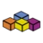

  

<h1 align="center">neikiri</h1>

<h3 align="center">Practical tools, clean interfaces, and automation that gets out of the way.</h3>

  
  
  
  

  I build zero-dependency frontend components, browser-based developer tools, Linux automation, 
  backend systems, and native desktop utilities.

  Based in the Czech Republic &middot; focused on software that is useful, fast, and pleasant to work with

---

<h2 align="center">👋 About Me</h2>

I like building small, focused software that solves annoying real-world problems.

My work ranges from embeddable Web Components and browser-based developer tools to Linux automation, backend systems, and native desktop utilities. I usually prefer simple architecture, zero or minimal dependencies, clean UI, and tools that are easy to integrate, maintain, and actually use.

---

<h2 align="center">🧩 What I Build</h2>

<table>
  <tr>
    <td width="50%" valign="top">
      <h3>Embeddable Web Components</h3>
      
Standalone, CDN-friendly frontend libraries including WYSIWYG editors, syntax-highlighted code editors, image galleries, cookie consent banners, live Markdown editors, and precision clock widgets.

    </td>
    <td width="50%" valign="top">
      <h3>CMS & Developer Tools</h3>
      
Lightweight content management systems, admin panels, analytics dashboards, localization tools, code formatters, Bash prompt builders, and web project scaffolding utilities.

    </td>
  </tr>
  <tr>
    <td width="50%" valign="top">
      <h3>Linux CLI & Server Tools</h3>
      
Command-line utilities for system management, firewall administration, diagnostics, VPN deployment, client profile generation, and practical Debian/Ubuntu automation.

    </td>
    <td width="50%" valign="top">
      <h3>Desktop & Server Extensions</h3>
      
Native desktop utilities, Windows shell integrations, context-menu file conversion tools, Python applications, and Bukkit/Spigot plugins with permissions and loop protection.

    </td>
  </tr>
</table>

---

<h2 align="center">🧠 Experience</h2>

<table>
  <tr>
    <td valign="top"><b>Frontend & UI Engineering</b></td>
    <td>Production-grade web components built from scratch with strong attention to polish, accessibility, mobile behavior, dark/light theming, and predictable integration.</td>
  </tr>
  <tr>
    <td valign="top"><b>Backend & Full-Stack Development</b></td>
    <td>Server-side systems with CMS workflows, role-based access, REST APIs, database architecture, authentication, and CSRF/XSS protection.</td>
  </tr>
  <tr>
    <td valign="top"><b>Linux Systems & Automation</b></td>
    <td>Hands-on scripting and administration across Debian/Ubuntu environments, including firewall rules, VPN setup, web scaffolding, diagnostics, and server networking.</td>
  </tr>
  <tr>
    <td valign="top"><b>Desktop Application Development</b></td>
    <td>Native desktop tools with Rust + Tauri, Windows shell integration, and Python + PyQt5 utilities for conversion workflows and productivity tasks.</td>
  </tr>
</table>

---

<h2 align="center">🎯 Focus Areas</h2>

  <code>Zero-dependency frontend components</code>
  <code>Developer tooling</code>
  <code>Linux server automation</code>
  <code>Desktop-native utilities</code>
  <code>Clean UI/UX</code>
  <code>Responsive dark/light themes</code>

---

<h2 align="center">🛠️ Technology Stack</h2>

<table align="center">
  <tr>
    <td align="center" width="110">
       <b>JavaScript</b>
    </td>
    <td align="center" width="110">
       <b>HTML</b>
    </td>
    <td align="center" width="110">
       <b>CSS</b>
    </td>
    <td align="center" width="110">
       <b>PHP</b>
    </td>
    <td align="center" width="110">
       <b>SQL</b>
    </td>
    <td align="center" width="110">
       <b>SEO</b>
    </td>
  </tr>
  <tr>
    <td align="center" width="110">
       <b>Python</b>
    </td>
    <td align="center" width="110">
       <b>C#</b>
    </td>
    <td align="center" width="110">
       <b>Git</b>
    </td>
    <td align="center" width="110">
       <b>Linux</b>
    </td>
    <td align="center" width="110">
       <b>Bash</b>
    </td>
    <td align="center" width="110">
       <b>Batch</b>
    </td>
  </tr>
  <tr>
    <td align="center" width="110">
       <b>Pawn</b>
    </td>
    <td align="center" width="110">
       <b>VBA</b>
    </td>
    <td align="center" width="110">
       <b>Arduino</b>
    </td>
    <td align="center" width="110">
       <b>JSON</b>
    </td>
    <td align="center" width="110">
       <b>YAML</b>
    </td>
    <td align="center" width="110">
       <b>Markdown</b>
    </td>
  </tr>
</table>

---

<h2 align="center">📊 Github Activity</h2>

  

---

<h2 align="center">🐶 Beyond Code</h2>

  I have a dachshund named Čenda. 
  I enjoy optimizing everything, sometimes a little too much. 
  I prefer practical solutions over theory.

---

<h3 align="center">
  <i>Turning "just add a script tag" into a philosophy</i>
</h3>